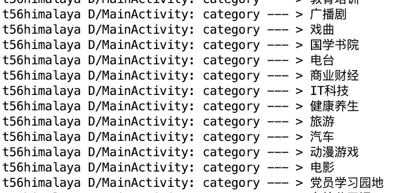
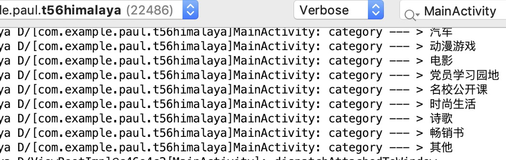
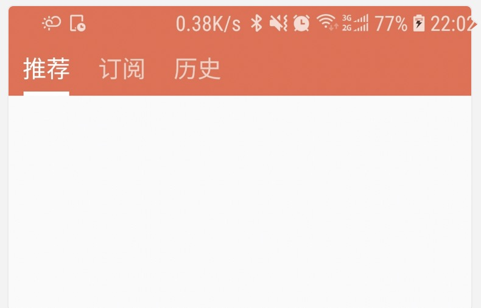
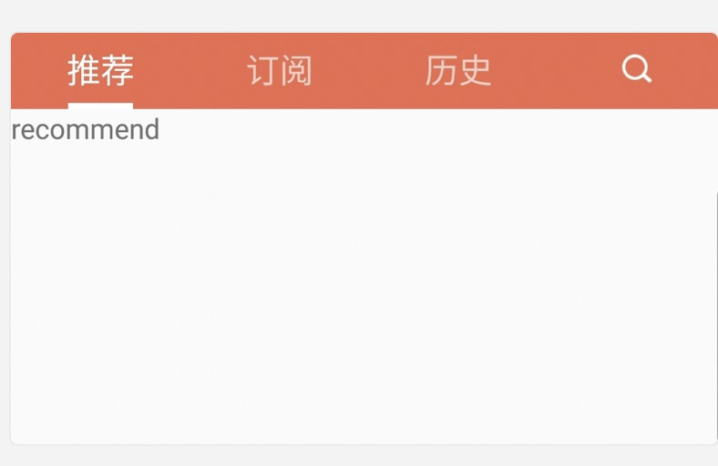

# t56Himalaya
see: https://space.bilibili.com/44272436/video

# class 3 集成喜马拉雅的SDK



# class 4 0227 添加自定义的Log 输出格式



# lesson 6 done 添加indicator



# lesson 7 indicator 和 viewpager 的联动

增加indicator 的tab click 触发viewpager的跳转能力


# lesson8+9 增加一个search icon



# lesson 10 get data done!!

```
03-13 22:47:35.132 6749-6749/com.example.paul.t56himalaya D/[com.example.paul.t56himalaya]RecommendFragment: got! size --- >20
```


# L11 获取数据到recyclerView OK了


# L12 UI 优化： 实现 圆角和间隙

- [x] 优化了封面图：

把背景蓝色图去掉了，用fitxy 以至于不显示之

普通矩形-》 圆角矩形, by: `RoundRectImage.java`

- [x] 优化了rv 的 间隙

增加recyclerView的间隙  by:

 `recyclerView.addItemDecoration()`

用到一个UI  dip2px 的工具类:

`UIUtil.dip2px(view.getContext(), 10);`

item 卡片也有圆角，by 添加一个`shape_album_item_bg.xml`

上下左右都有间隙，最终效果如图


